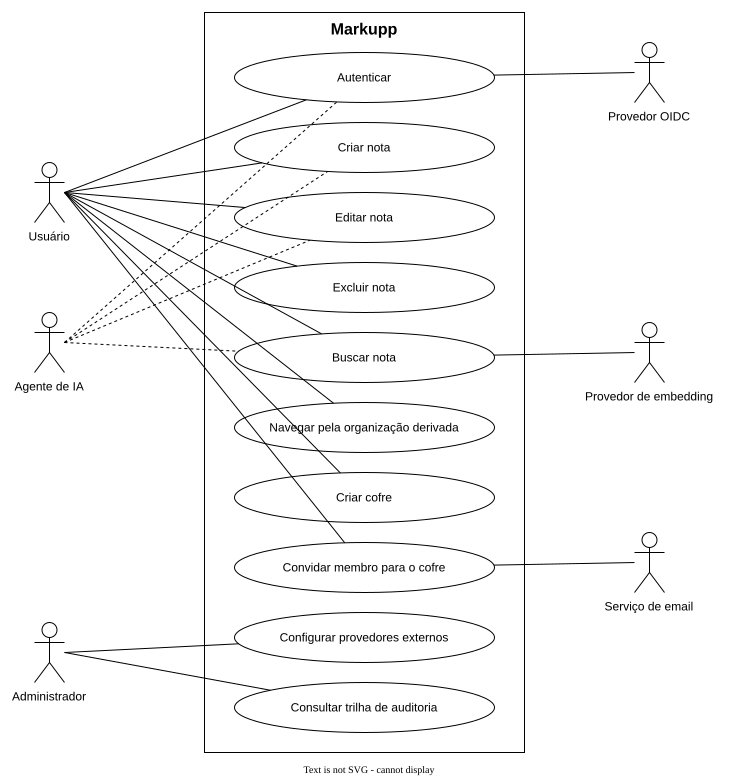

# Casos de uso

Três atores usam o sistema. O usuário escreve e lê pelo painel web ou por um plugin de
editor. O agente de IA faz o mesmo pelo servidor MCP, com o conjunto menor de operações que
cabe numa conversa. O administrador não escreve nota, configura a instalação.

Provedor OIDC, provedor de embedding e serviço de email aparecem à direita porque o sistema
depende deles para completar um caso de uso, e não porque alguém os opera.

## Autenticar

Ator: usuário, agente de IA.

O ator apresenta credencial local ou é redirecionado ao provedor OIDC habilitado. No
retorno, o servidor liga o identificador do provedor a uma conta de chave estável e abre a
sessão. Conta que ainda não existe só é criada se o auto-registro estiver ligado, e ele vem
desligado.

## Criar nota

Ator: usuário, agente de IA.

O ator envia caminho e conteúdo para um cofre de que é membro. O servidor grava a nota,
registra a operação na trilha de auditoria na mesma transação e enfileira a indexação.
Caminho já ocupado dentro do cofre rejeita a criação.

## Editar nota

Ator: usuário, agente de IA.

O ator envia o conteúdo novo junto da versão que leu. Se a nota mudou desde então, o
servidor recusa e devolve conflito, e o ator decide entre reler ou forçar a sobrescrita.
Cada gravação aceita reindexa a nota.

## Excluir nota

Ator: usuário.

O ator remove a nota de um cofre de que é membro. O dado derivado da nota sai do plano de
recuperação na reindexação seguinte.

## Buscar nota

Ator: usuário, agente de IA.

A consulta corre em dois ramos. O léxico usa o índice de texto e devolve relevância e trecho
destacado. O semântico transforma a consulta em vetor pelo provedor de embedding e busca por
proximidade. O resultado combina os dois e cobre só os cofres de que o ator é membro. Sem
provedor de embedding configurado, sobra o ramo léxico.

## Navegar pela organização derivada

Ator: usuário.

O usuário percorre a base pelas ligações e pelos agrupamentos que o servidor calculou, em
vez da árvore de caminhos. A visão é por cofre, então tema que atravessa cofres não aparece
agrupado.

## Criar cofre

Ator: usuário.

Qualquer usuário cria um cofre e vira membro dele. O cofre nasce vazio, com namespace de
caminho próprio.

## Convidar membro para o cofre

Ator: usuário.

Um membro convida outro usuário. O servidor enfileira a notificação, e o worker envia pelo
provedor de email configurado, fora do caminho da requisição. Sem provedor configurado o
convite não sai. Quem aceita passa a ler e escrever todas as notas do cofre, e pode remover
qualquer membro, inclusive quem criou.

## Configurar provedores externos

Ator: administrador.

O administrador liga e desliga provedores de autenticação, de email e de embedding na
configuração da instalação. Trocar o modelo de embedding obriga reconstruir a tabela de
vetores, porque vetores de modelos diferentes não se comparam.

## Consultar trilha de auditoria

Ator: administrador.

O administrador lê as operações críticas registradas, com tenant, ator, ação, alvo, momento
e resultado. A trilha só aceita inserção, então não existe caso de uso de editar ou apagar
registro.
