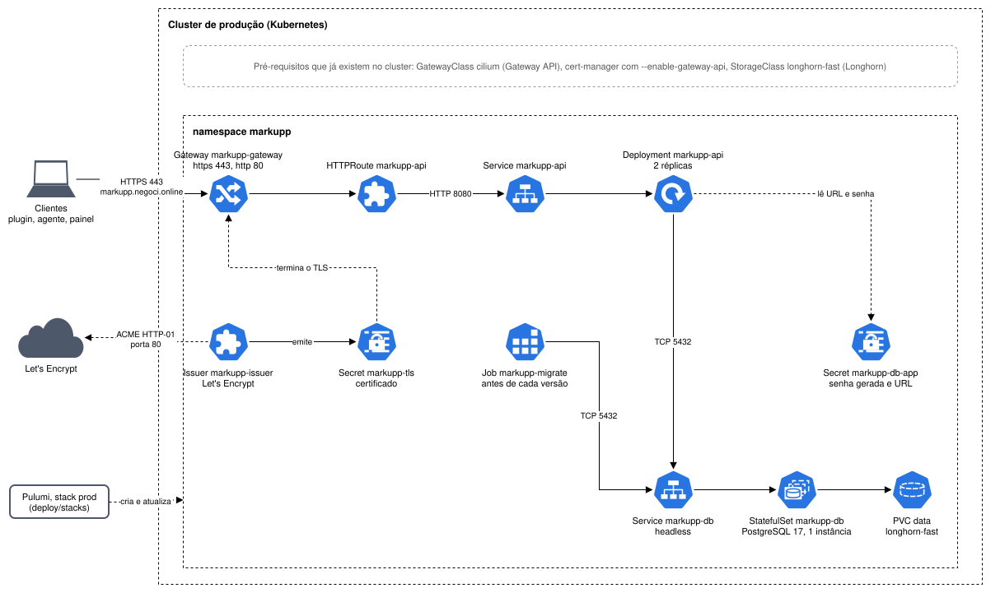

# Diagrama de implantação

Diagrama de implantação no estilo C4, com os ícones do Kubernetes. Mostra o que a stack prod
cria no cluster de produção e o que ela usa sem criar. O desenho por serviço está nos
[diagramas de blocos](diagramas-de-blocos.md).

## O que já existe no cluster

GatewayClass do Cilium, cert-manager e a StorageClass longhorn-fast já estão instalados e são
usados por outros projetos. O markupp só os usa: tudo o que ele cria fica dentro do namespace
markupp, e nada muda na configuração do cluster.

## Entrada

O cliente chega por HTTPS em markupp.negoci.online. O Gateway termina o TLS e o HTTPRoute
encaminha para o Service da API. O certificado vem do Issuer, que valida o domínio no Let's
Encrypt pela porta 80 e grava o resultado no Secret markupp-tls.

## API e banco

A API roda como Deployment de duas réplicas e fala com o PostgreSQL pelo Service markupp-db. O
banco é um StatefulSet de uma instância, com o volume num PVC da longhorn-fast. Sem failover:
se o nó do banco cair, a API fica sem banco até o pod subir em outro nó.

O Secret markupp-db-app guarda a senha gerada pelo Pulumi e a URL de conexão. A API e o Job
leem a URL, e o PostgreSQL lê a senha.

## Ordem de subida

O Pulumi cria o banco, espera ele aceitar conexão, roda o Job de migração até ele terminar, e
só então atualiza a API. O schema muda antes de qualquer réplica nova atender.

## Na stack dev

A stack dev, no kind do CI e do make kind-up, cria os mesmos recursos. Mudam três coisas: o
certificado é autoassinado, o volume usa a StorageClass do kind, e a API tem uma réplica.
