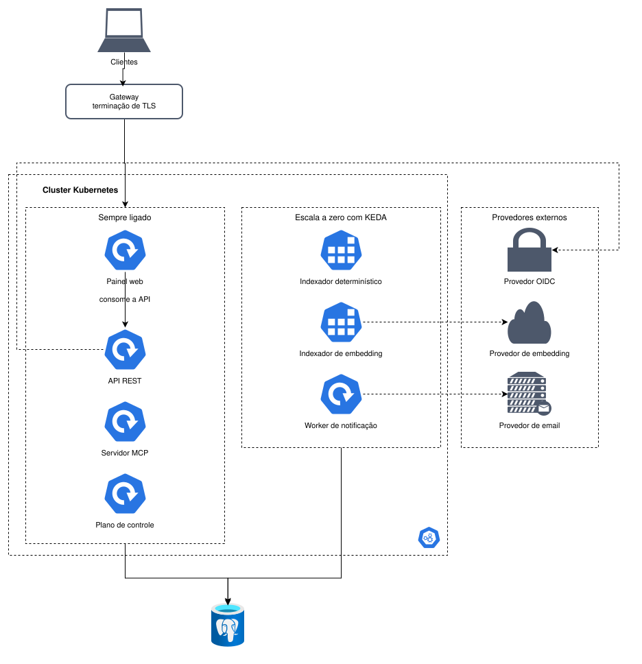

# Diagramas de blocos

O sistema se divide em sete artefatos. A divisão segue perfil de recurso, não entidade de
domínio: nota, cofre, usuário e busca não são serviços, compartilham banco e caminho de
requisição. Dividir por entidade transformaria a escrita de uma nota em várias chamadas de
rede com transação distribuída.

## Clientes

Cliente é tudo que consome o markupp: navegador, plugin de editor, agente de IA e o que
vier depois. Todos são pares. Nenhum toca o armazenamento, nenhum tem rota privilegiada, e
todos enxergam o mesmo conjunto de operações.

O navegador baixa o painel web do armazenamento de objeto com CDN e depois fala com a API
como qualquer outro cliente.

## Sempre ligado

A **API REST** é a porta REST dos clientes, tem carga constante e é o caminho de entrada e
saída de todo conteúdo.

O **servidor MCP** é a porta MCP dos mesmos clientes, com o mesmo conjunto de operações e
uma rajada de tráfego própria. O isolamento é mútuo, e nenhum dos dois perfis de carga
degrada o outro.

O **plano de controle** cuida de cobrança, provisionamento e plano. Tráfego baixo e postura
de segurança distinta dos outros dois.

## Escala a zero

O **indexador determinístico** gasta CPU em rajada e não carrega modelo. Roda como Job e
some quando não há nota para indexar.

O **indexador de embedding** tem perfil próprio, com acelerador quando o modelo é local. Sai
caro ligado, então escala a zero importa mais aqui do que em qualquer outro serviço.

O **worker de notificação** trata rajada com repetição, fora do caminho da requisição.

## Dados

Um PostgreSQL só, com o plano de registro e o plano de recuperação dentro dele. Os vetores
ficam em pgvector.

Os sete serviços compartilham esse banco, então o isolamento entre eles é de processo e de
escala, não de dado. Não são microsserviços no sentido de banco por serviço.

## Provedores externos

A API REST valida identidade contra o provedor OIDC habilitado, o indexador de embedding
gera vetores pelo provedor configurado, e o worker de notificação entrega email pelo dele.

Os três são trocáveis por configuração, e é por isso que o desenho não nomeia serviço. O
Enterprise liga Bedrock e SES, o self-host aponta para um modelo local e um SMTP próprio, e
o código é o mesmo nos dois.

## O que muda no self-host

O mesmo conjunto de imagens roda por compose num nó só. Sem cluster, sem CDN, o TLS termina
no próprio servidor, e o embedding pode vir de modelo local carregado no processo do
indexador.

A visão C4 do sistema é mantida no repositório do plugin (ADR-0030).
