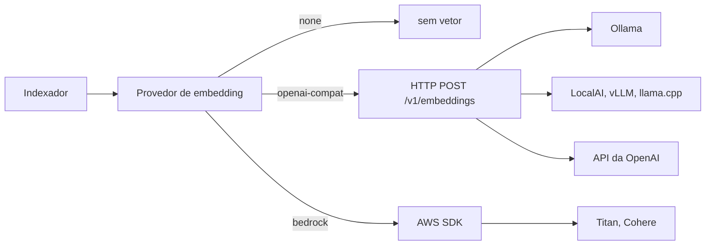

# Embedding

Configuração planejada, ainda não implementada. A razão de ser plugável está no ADR-0019.

## Escolha rápida

| Provedor | Onde o modelo roda | Custo | Quando usar |
| --- | --- | --- | --- |
| `none` | nenhum | zero | Padrão do self-host. Busca léxica e grafo funcionam sem vetor |
| `openai-compat` | máquina de quem hospeda | elétrico | Self-host que quer busca semântica sem serviço externo |
| `openai-compat` | API da OpenAI | por token | Quem já tem chave e não quer rodar modelo |
| `bedrock` | AWS | por token | Padrão do Enterprise, indexação em Lambda |

## Como funciona



Uma interface, duas implementações. Toda ferramenta local de inferência expõe endpoint
compatível com a OpenAI, então o caso local e o caso hospedado usam o mesmo cliente HTTP,
mudando só a URL.

## none

Padrão. Omita o bloco `embedding` ou escreva:

```json
{ "embedding": { "provider": "none" } }
```

Busca léxica (ADR-0017) e grafo de ligações continuam completos. Sugestão de ligação cai para
o método estrutural, sem o braço semântico.

## openai-compat com Ollama

Serviço no compose:

```yaml
  ollama:
    image: ollama/ollama
    volumes:
      - ollama_models:/root/.ollama
```

Baixe o modelo uma vez:

```bash
docker compose exec ollama ollama pull nomic-embed-text
```

Configuração:

```json
{
  "embedding": {
    "provider": "openai-compat",
    "base_url": "http://ollama:11434/v1",
    "model": "nomic-embed-text",
    "dimensions": 768
  }
}
```

Alternativa com mais qualidade e mais RAM: `mxbai-embed-large`, 1024 dimensões.

## openai-compat com a API da OpenAI

```json
{
  "embedding": {
    "provider": "openai-compat",
    "base_url": "https://api.openai.com/v1",
    "api_key": "${OPENAI_API_KEY}",
    "model": "text-embedding-3-small",
    "dimensions": 1536
  }
}
```

`text-embedding-3-large` tem 3072 dimensões. Os dois aceitam redução de dimensão pelo campo
`dimensions`, o que diminui armazenamento e custo de índice com perda pequena de qualidade.

## bedrock

Padrão do Enterprise. Sem chave no arquivo: a credencial vem do papel de execução da Lambda.

```json
{
  "embedding": {
    "provider": "bedrock",
    "region": "us-east-1",
    "model": "amazon.titan-embed-text-v2:0",
    "dimensions": 1024
  }
}
```

O Titan v2 aceita 256, 512 ou 1024. Para acervo multilíngue, `cohere.embed-multilingual-v3`
com 1024.

## Trocar de modelo obriga reindexar

Vetor de modelo diferente não é comparável: cada modelo produz um espaço próprio, e a dimensão
muda. Trocar `model` sem reconstruir faz a busca semântica devolver resultado sem sentido, e
sem erro nenhum.

O modelo ativo fica registrado junto dos vetores. Ao detectar divergência, o indexador apaga a
tabela de vetores e refaz. Isso é seguro porque vetor é dado derivado (ADR-0012), mas custa uma
passada de embedding sobre todas as notas, o que no Bedrock é custo por chamada.
