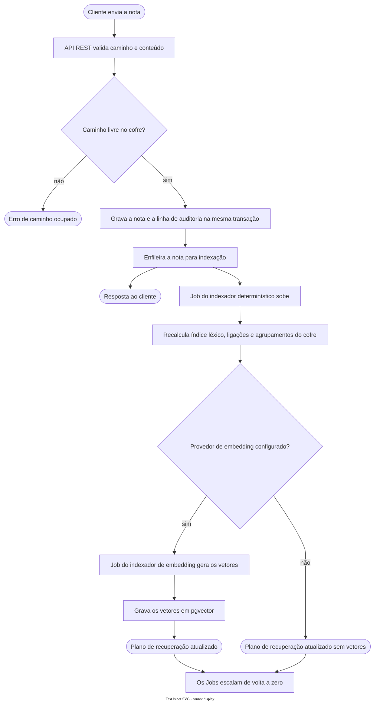
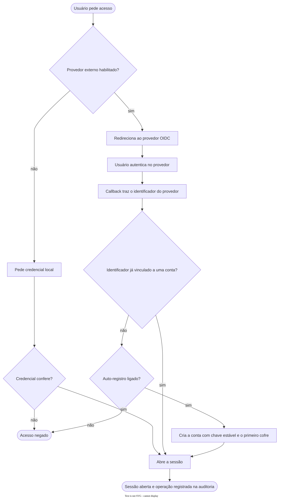
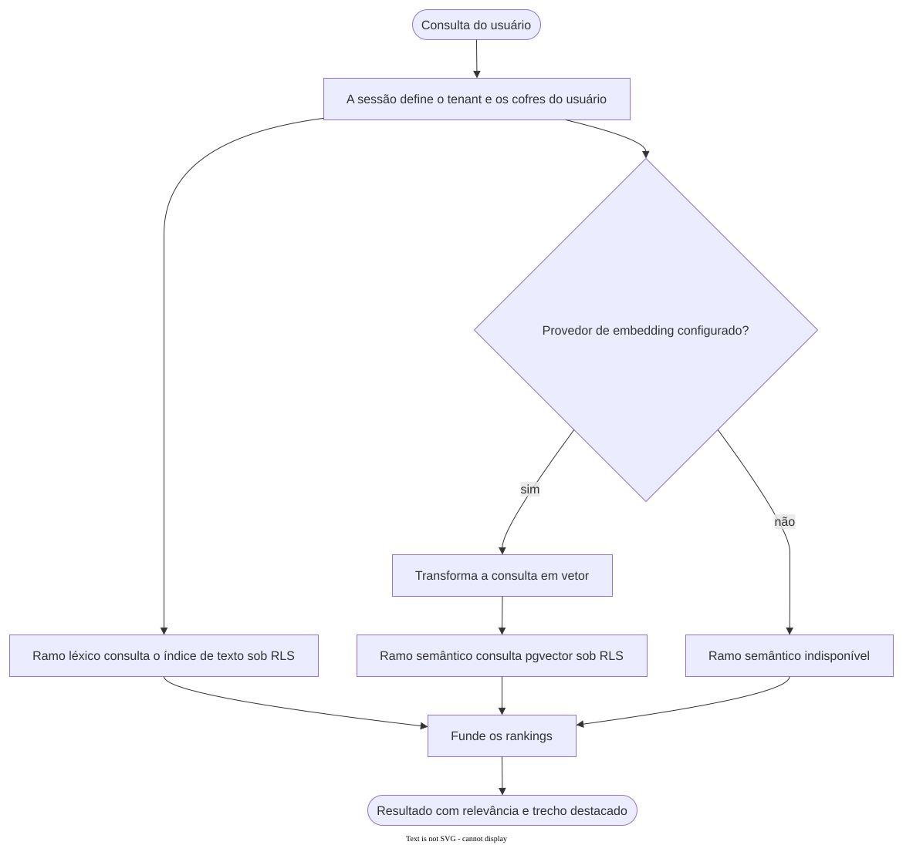
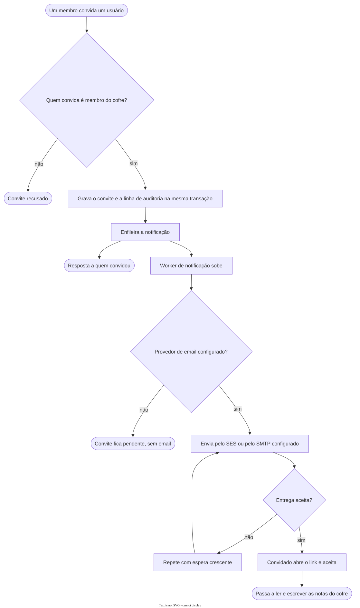

# Fluxogramas

Quatro fluxos, escolhidos porque cada um atravessa uma fronteira que os outros documentos
descrevem parada: a separação entre plano de registro e plano de recuperação, a troca com o
provedor de identidade, a fusão dos dois ramos de busca e a saída de email fora do caminho
da requisição.

## Indexação de nota

A gravação e a indexação se separam no momento em que a nota entra. A resposta ao cliente
sai assim que a transação fecha, e a indexação segue em Job que subiu do zero.

Isso é o que torna o índice eventualmente consistente por escolha. Uma nota recém-salva pode
não aparecer na busca no segundo seguinte, e a alternativa seria prender a latência da
escrita ao tempo de gerar embeddings.

Sem provedor de embedding configurado, o ramo de vetores simplesmente não acontece e o
índice léxico fica completo do mesmo jeito.

## Autenticação por provedor externo

Os dois caminhos, credencial local e provedor externo, terminam na mesma abertura de sessão.
A diferença entre as edições é qual provedor está ligado, não qual código roda.

O ponto que costuma passar batido é o auto-registro desligado. Um usuário que autentica com
sucesso no provedor externo e não tem conta vinculada continua sem acesso, porque autenticar
prova identidade e não concede entrada.

## Busca com relevância

Os dois ramos correm sobre a mesma sessão, que já carrega o tenant e os cofres do usuário.
Isso é o que dispensa filtro de acesso escrito em cada consulta: a política de linha do
banco recorta o resultado antes da fusão.

Sem provedor de embedding, a busca não quebra, encolhe para o ramo léxico.

## Convite para cofre com email

O convite é gravado e auditado na mesma transação, e o email sai depois, por um worker
separado que repete com espera crescente. Um servidor de email lento atrasa a chegada do
convite, não a resposta de quem convidou.

Sem provedor de email configurado o convite fica gravado e não é entregue, o que é o
comportamento declarado no ADR-0021 para todo fluxo que depende de envio.
